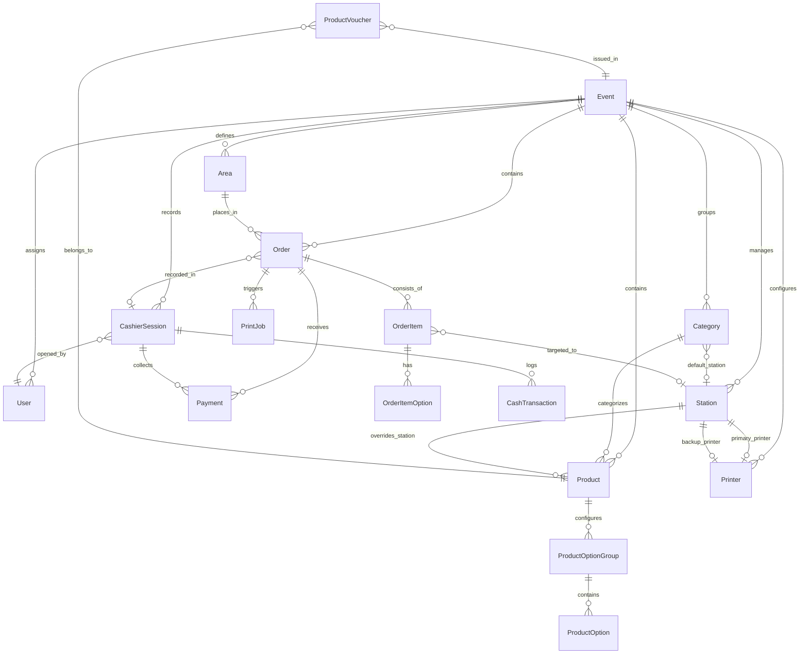
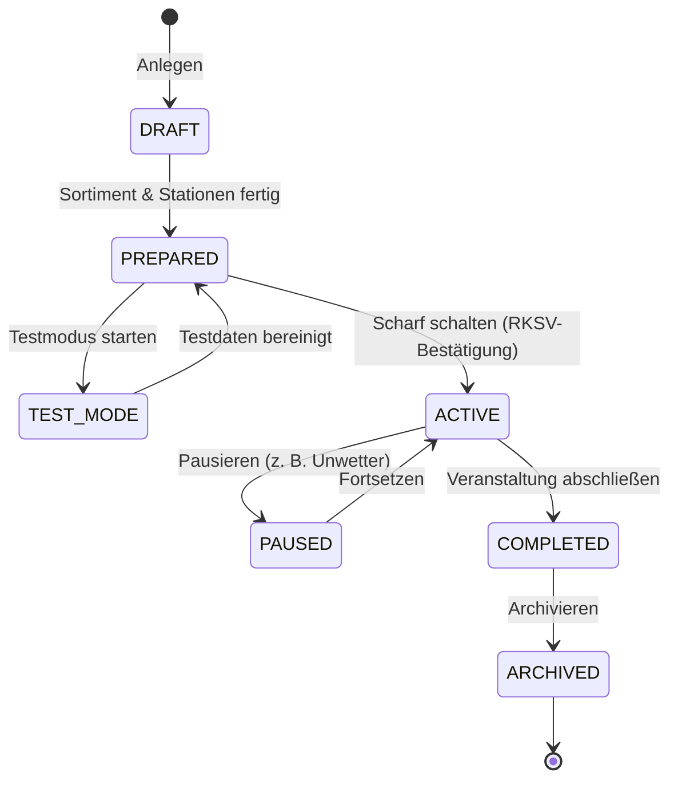
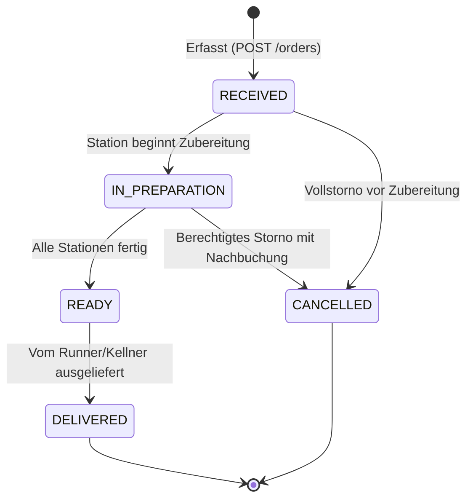
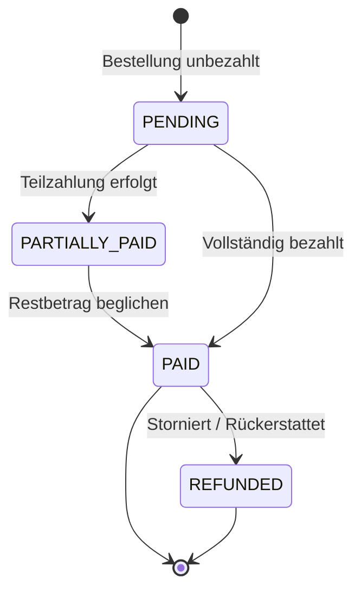
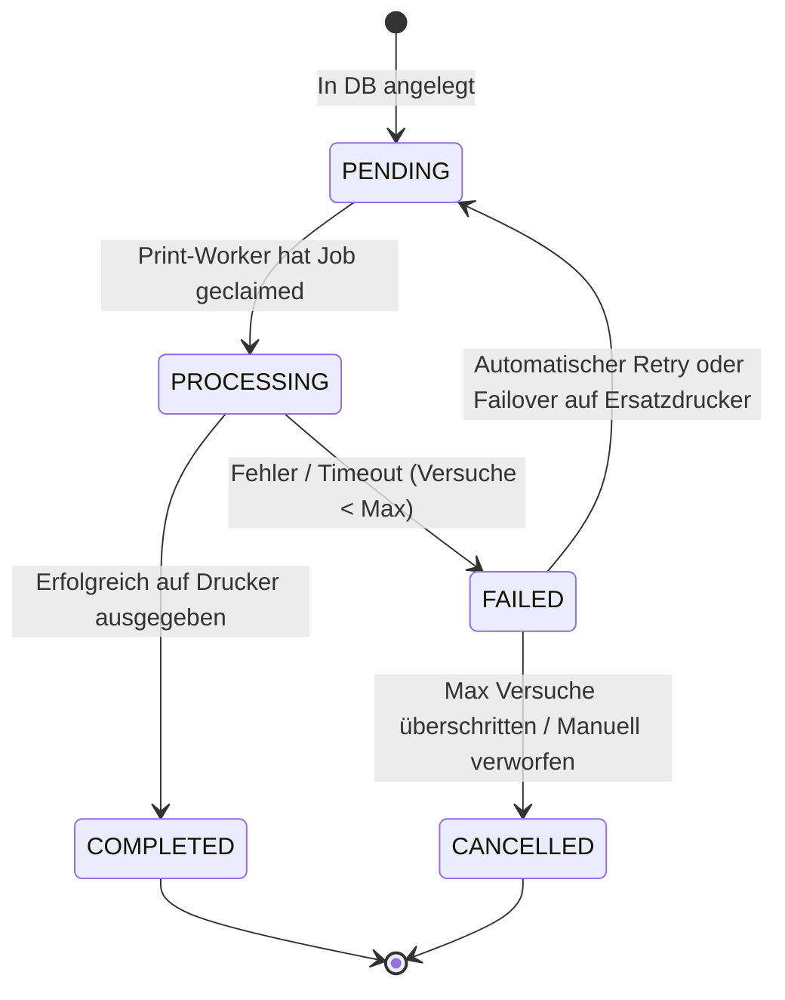

# Datenmodell und Statusmaschinen

Dieses Dokument beschreibt das vollständige relationale Datenmodell von VereinOrder sowie die definierten Statusmaschinen für Bestellungen, Kassen, Bons und Druckaufträge.

---

## 1. Relationales Datenbankschema (ER-Diagramm)

---

## 2. Kernentitäten und Invarianten

| Entität          | Zweck                 | Zentrale Felder & Invarianten                                                                                                                                                       |
| ---------------- | --------------------- | ----------------------------------------------------------------------------------------------------------------------------------------------------------------------------------- |
| `Event`          | Veranstaltungskontext | `id`, `name`, `status`, `testMode` (Boolean), `rksvConfirmedAt`. Bestimmt den Mandantenkontext für alle Daten.                                                                      |
| `Product`        | Verkaufsprodukt       | `id`, `name`, `priceCents` (`INTEGER`), `availability` (`AVAILABLE`, `LOW`, `OUT_OF_STOCK`), `categoryId`, `stationId` (optional).                                                  |
| `Category`       | Warengruppe           | `id`, `name`, `sortOrder`, `targetStationId` (Standard-Zielstation für alle Produkte dieser Kategorie).                                                                             |
| `Station`        | Zubereitungsort       | `id`, `name`, `primaryPrinterId`, `backupPrinterId`.                                                                                                                                |
| `Order`          | Bestellkopf           | `id`, `orderNumber` (`INTEGER` fortlaufend je Event), `pickupNumber` (`INTEGER` fortlaufend tagesaktuell), `idempotencyKey` (`UNIQUE`), `totalCents`, `status`, `cashierSessionId`. |
| `OrderItem`      | Bestellposition       | `id`, `orderId`, `productId`, `quantity`, `unitPriceCents`, `totalPriceCents`, `status`, `stationId`.                                                                               |
| `Payment`        | Zahlungstransaktion   | `id`, `orderId`, `cashierSessionId`, `amountCents`, `paymentMethod` (`CASH`, `CARD`, `VOUCHER`, `OTHER`), `status`.                                                                 |
| `CashierSession` | Kassensitzung         | `id`, `userId`, `eventId`, `startingBalanceCents`, `closingBalanceCents`, `status` (`ACTIVE`, `CLOSED`), `startTime`, `endTime`.                                                    |
| `PrintJob`       | Druckauftrag          | `id`, `documentType`, `status` (`PENDING`, `PROCESSING`, `COMPLETED`, `FAILED`, `CANCELLED`), `printerId`, `rawPayload`, `attempts`.                                                |
| `AuditLog`       | Revisionsprotokoll    | `id`, `userId`, `action`, `entityType`, `entityId`, `details` (JSON), `createdAt`.                                                                                                  |

---

## 3. Statusmaschinen

### A. Event-Status (`EventStatus`)

### B. Bestellstatus (`OrderStatus`)

### C. Zahlungsstatus (`PaymentStatus`)

### D. Druckauftrag-Status (`PrintJobStatus`)

