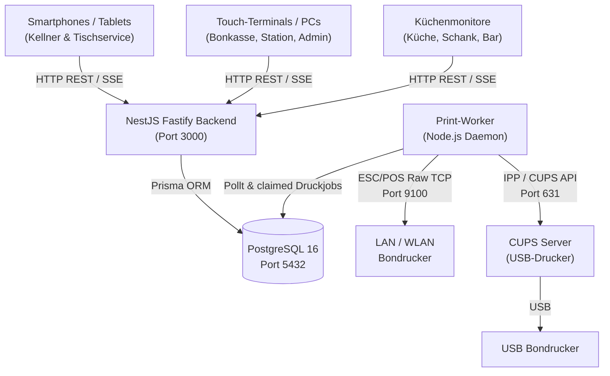
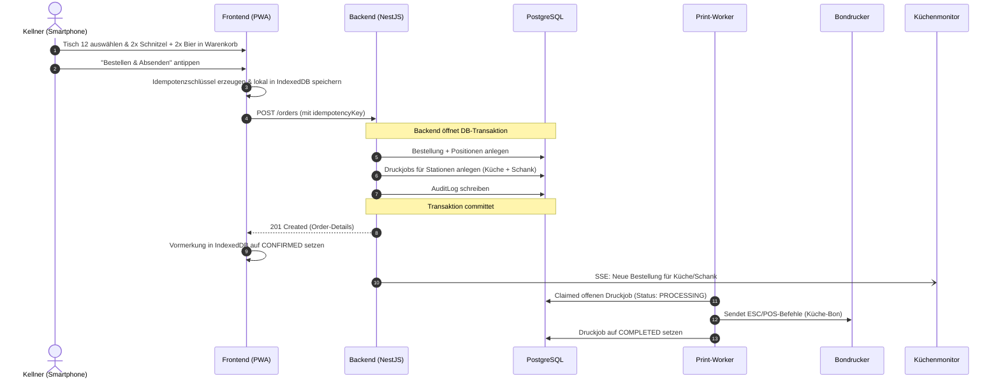

# Systemarchitektur von VereinOrder

Dieses Dokument beschreibt die Gesamtarchitektur, die Komponenten und den Datenfluss von VereinOrder für den lokalen Festbetrieb.

---

## 1. Architektur-Leitprinzipien

1. **Vollständige Autarkie im Festbetrieb:**  
   VereinOrder funktioniert im laufenden Betrieb zu 100 % ohne externe Internetverbindung. Sämtliche Skripte, Styles, Schriftarten und Icons werden lokal vom Server ausgeliefert.
2. **Rechtliche Klarheit (Keine RKSV-Registrierkasse):**  
   VereinOrder ist ein internes Bestell- und Boniersystem und enthält keine RKSV-Signaturerstellung oder Fiskalkassen-Zertifizierung.
3. **Centgenaue Geld- und Datensicherheit:**  
   Beträge werden ausnahmslos als ganzzahlige Cent-Werte (`INTEGER`) modelliert. Es gibt keine Rundungsfehler durch Gleitkommazahlen.
4. **Idempotenz & Ausfallsicherheit:**  
   Jede Bestellung und Zahlung besitzt einen Idempotenzschlüssel (`idempotencyKey`), sodass Netzwerkunterbrechungen niemals zu Doppelbuchungen führen.
5. **Persistente Druckwarteschlange:**  
   Druckaufträge werden zuerst transaktionssicher in PostgreSQL abgelegt und von einem separaten Druck-Worker asynchron und mit automatischem Failover verarbeitet.

---

## 2. Komponentenübersicht (Monorepo)

---

## 3. Schichtenarchitektur

### A. Frontend (`apps/frontend`)

- **Technologie:** React 18, TypeScript, Vite, Tailwind CSS, Lucide Icons.
- **PWA-Fähigkeit:** Service Worker mit Offline-Asset-Caching (`vite-plugin-pwa`).
- **Offline-Warteschlange:** Eigene `IndexedDB`-Schicht zur Pufferung unbestätigter Vormerkungen bei Funklöchern.
- **Zustandsverwaltung:** Zustand (`zustand`) für Warenkorb, Authentifizierung und Offline-Warteschlange.
- **Echtzeit-Synchronisation:** Server-Sent Events (SSE) für Statusaktualisierungen (Bestellungen, Ausverkauft, Druckjobs).

### B. Backend (`apps/backend`)

- **Technologie:** NestJS 10 mit Fastify-Adapter für hohe Performance und geringen Speicherverbrauch auf ARM64/Raspberry Pi.
- **Validierung:** Globale `ValidationPipe` mit `class-validator` zur strikten DTO-Prüfung.
- **Authentifizierung:** JWT (`@nestjs/jwt`) mit bcrypt-gehashten PINs und Rollenprüfung (`RolesGuard`, `AdminSessionGuard`).
- **Echtzeit:** SSE-Controller (`/realtime/stream`) mit Ereignisverteilung über `EventEmitter2`.
- **Datensicherung:** Natives `pg_dump`/`pg_restore`-Management mit automatischer Umschaltung in den Wartungsmodus.

### C. Datenbank (`packages/database`)

- **Technologie:** PostgreSQL 16 mit Prisma ORM.
- **Migrationen:** Eingecheckte, nachvollziehbare SQL-Migrationen unter `packages/database/prisma/migrations/`.
- **Transaktionssicherheit:** Prisma `$transaction` für alle Bestell-, Zahlungs-, Storno- und Kassenabschlussoperationen.

### D. Print-Worker (`apps/print-worker`)

- **Eigenständiger Prozess:** Pollt und claimed Druckaufträge transaktionssicher aus der Tabelle `PrintJob`.
- **Adapter-Architektur:**
  - `TcpPrinterAdapter`: Direkter ESC/POS-Stream über Raw TCP (Port 9100).
  - `CupsPrinterAdapter`: Ansteuerung lokaler USB-Drucker über IPP/CUPS.
  - `SimulatorAdapter`: Dateibasierter Drucksimulator für automatisierte Tests und Entwicklung.
- **Failover:** Automatisches Umschalten auf konfigurierte Ersatzdrucker (`backupPrinterId`) bei Verbindungsabbrüchen oder Timeouts.

---

## 4. Typischer Datenfluss einer Bestellung

